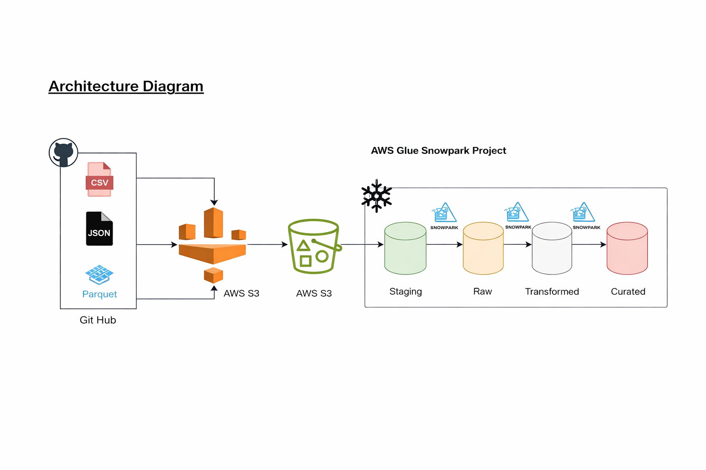
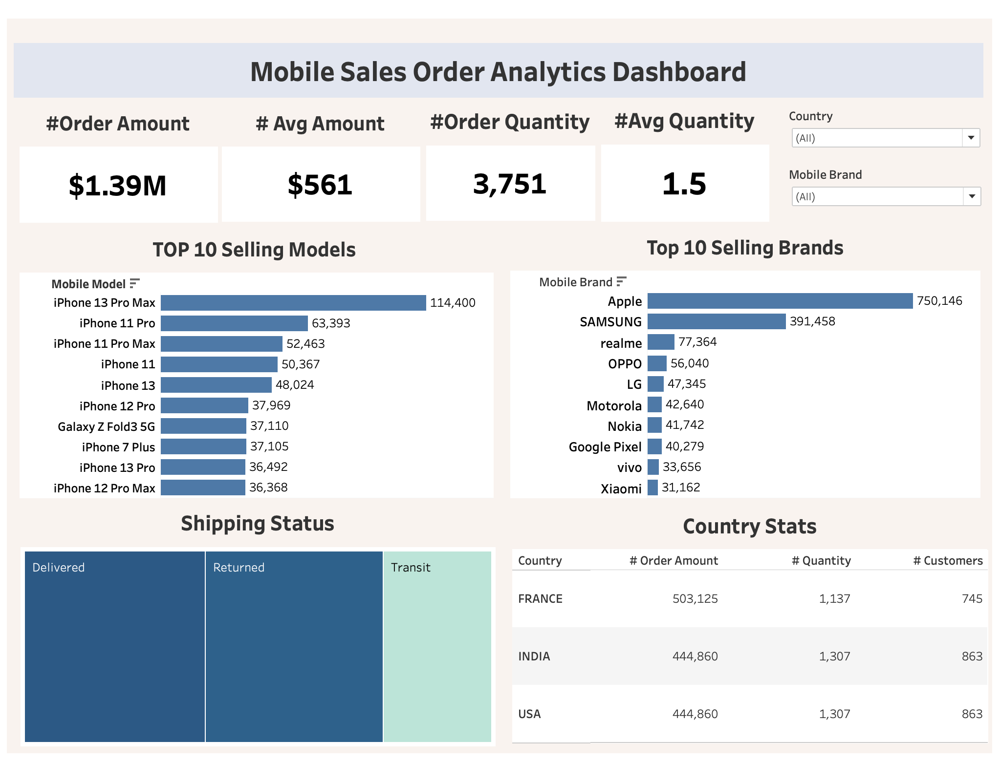

# End-to-end-Sales-Analytics-Pipeline-using-AWS-S3-Glue-and-Snowpark

## Objective:
In this project, I am building end to end analytics pipeline for mobile phone sales across multiple countries, by fetching sales order data stored in different formats i.e. CSV, JSON and Parquet, using AWS Glue job, storing in S3 bucket,before transforming, modeling, and analyzing it in Snowflake using Snowpark.

## Architecture Diagram:

## Real Time Sales Order Analytics Dashboard in Tableau:

